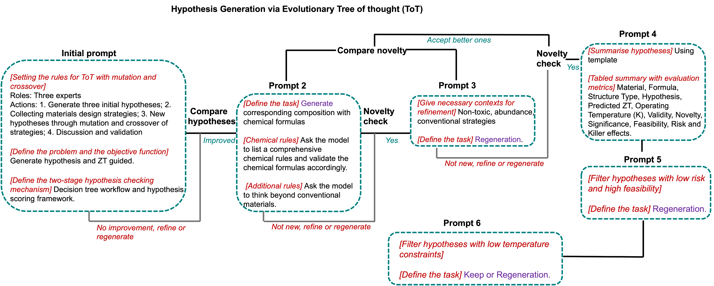

<h1 align="center"> 🌲Evo-ToT-reasoning</h1>

🧪 **Prompt-Driven Hypothesis Evolution Framework for Thermoelectric Materials**

This repository implements a multi-stage prompting system using OpenAI's GPT-4o and reasoning models (like o1 and o3-mini) to simulate expert thinking in generating, evaluating, refining, and summarizing hypotheses for thermoelectric materials discovery.

📌 **Features**

🧠 Tree-of-Thought style evolution across expert agents

🔁 Sequential module prompts simulating scientific workflows

📊 Hypothesis evaluation with scoring and decision tree logic

📦 Exportable results as CSV tables (ZT, feasibility, risk, etc.)

📈 Optional visualizations for tracking hypothesis evolution

🧬 **Prompt Modules**

Each stage in the hypothesis generation pipeline is structured as a named module, simulating a logical thought progression:

Module Name	Purpose
Setting the rules for evolutionary tree of thought	Defines thinking structure, agents, and evaluation pipeline
check_evolution	Validates improved hypotheses after crossover/mutation
generating hypothesis with chemical formulas	Forces concrete chemical proposal and rule-based reasoning
novelty evaluation	Evaluates whether hypotheses are genuinely novel
context guidance	Provides background research to inspire further refinements
compare_hypotheses	Performs comparative analysis of generated hypotheses
summarising_hypothesis	Formats hypotheses into structured tables
removing_low_feasibility_hypotheses	Filters out weak proposals
zoom_into_low_temperature_hypotheses	Focuses on low-T materials (<600K)
summarising_all_hypotheses	Outputs final comparative table and trend summary

🧠 **How It Works**
1. Sequential Prompt Chaining

final_output = run_sequential_prompt_pipeline(
    module_names=[
        "Setting the rules for evolutionary tree of thought",
        "check_evolution",
        ...
        "summarising_all_hypotheses"
    ],
    model_name="gpt-4o"
)

Each module prompt is dynamically retrieved and appended to the previous output for rich context evolution.

3. 📂 LLM Response Logging
   
All responses are saved:

As .txt or .md logs in the current folder

Hypothesis tables are extracted and saved as .csv

🧩 Try out our JupyterNotebook!

📜 License
MIT — feel free to use or build upon this for scientific or educational purposes.
